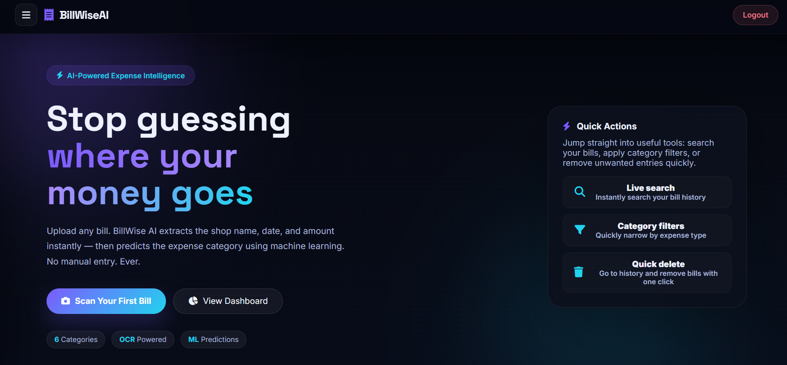
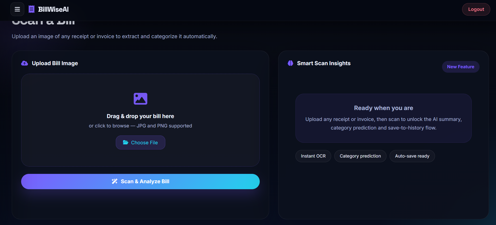
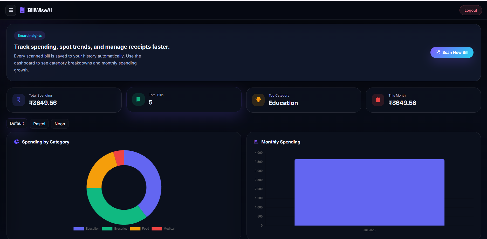
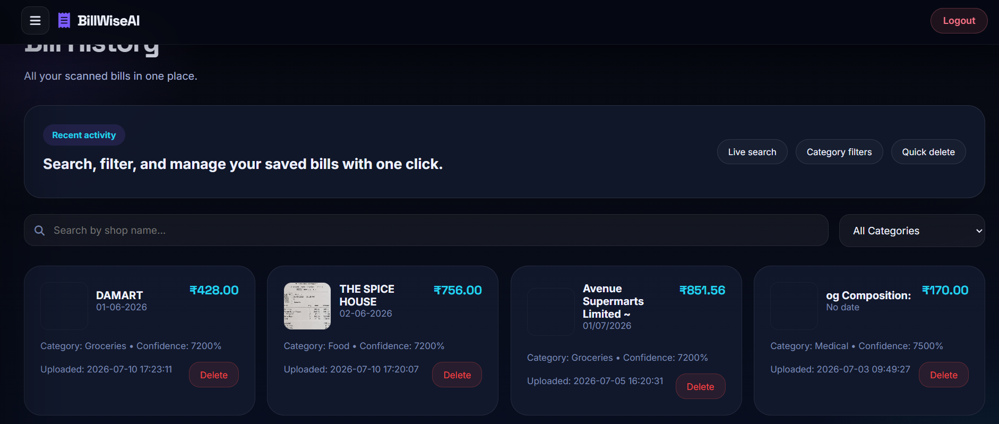

# 💸 BillWise AI

<div align="center">

### 🤖 AI-Powered Smart Expense Tracker using OCR & Machine Learning

Automatically scan receipts, extract bill details using OCR, categorize expenses using Machine Learning, and visualize spending with an interactive dashboard.

<p>


</p>

🌐 **Live Demo:** https://billwise-ai-2.onrender.com

</div>

---

# 📖 Overview

BillWise AI is a cloud-based intelligent expense management system that helps users digitize and organize bills effortlessly.

Instead of manually entering expense details, users simply upload an image of a receipt. The system automatically:

- Extracts text using OCR
- Identifies merchant name
- Detects bill amount
- Predicts expense category using Machine Learning
- Converts foreign currencies (when applicable)
- Stores expenses securely in MySQL Cloud
- Displays analytics through an interactive dashboard

---

# ✨ Features

## 📷 Smart Bill Scanning

- Upload receipt images
- OCR-based text extraction
- Image preprocessing for improved accuracy
- Automatic bill information extraction

---

## 🤖 AI Expense Categorization

Machine Learning automatically classifies bills into categories such as

- 🍔 Food
- 🛒 Grocery
- 🛍 Shopping
- 🏥 Healthcare
- 🚗 Transport
- 🎓 Education
- 🎬 Entertainment
- 💡 Utilities
- 🏨 Hotel
- 📦 Others

---

## 💱 Currency Conversion

Supports multiple currencies and converts expenses into the desired currency using live exchange rates.

---

## 📊 Dashboard Analytics

View

- Total expenses
- Monthly spending
- Recent bills
- Category distribution
- Expense history

---

## 🔐 User Authentication

- Signup
- Login
- Session Management
- Secure password hashing

---

## ☁️ Cloud Database

Stores

- Bills
- Users
- Categories
- Expense history

using Aiven Cloud MySQL.

---

## 🐳 Docker Deployment

Containerized application for easy deployment on Render.

---

# 🖥 Screenshots

## Home Page

> *(Add Screenshot Here)*



---

## Upload Bill

> *(Add Screenshot Here)*



---

## Dashboard

> *(Add Screenshot Here)*



---

## Expense History

> *(Add Screenshot Here)*



---

# ⚙️ Technology Stack

## Frontend

- HTML5
- CSS3
- JavaScript

---

## Backend

- Python
- Flask
- Gunicorn

---

## Machine Learning

- Scikit-Learn
- NumPy
- Joblib

---

## OCR

- Tesseract OCR
- OpenCV
- Pillow
- pytesseract

---

## Database

- MySQL
- Aiven Cloud

---

## Deployment

- Docker
- Render

---

# 🏗 System Architecture

```text
                  User
                    │
                    ▼
             Upload Receipt
                    │
                    ▼
          Image Preprocessing
                    │
                    ▼
             OCR Extraction
                    │
                    ▼
         Merchant & Amount Detection
                    │
                    ▼
       Machine Learning Prediction
                    │
                    ▼
        Currency Conversion (Optional)
                    │
                    ▼
          Save into Cloud Database
                    │
                    ▼
     Dashboard • Analytics • History
```

---

# 📂 Project Structure

```text
BillWise-AI
│
├── backend
│   ├── app.py
│   ├── database.py
│   ├── predictor.py
│   ├── ocr.py
│   ├── advanced_apis.py
│   ├── requirements.txt
│   └── uploads
│
├── frontend
│   ├── index.html
│   ├── upload.html
│   ├── dashboard.html
│   ├── history.html
│   ├── login.html
│   ├── signup.html
│   ├── script.js
│   └── style.css
│
├── ml
│   ├── model.pkl
│   └── vectorizer.pkl
│
├── database
│
├── Dockerfile
│
└── README.md
```

---

# 🚀 Installation

Clone repository

```bash
git clone https://github.com/ABHILASH630256/billwise-ai.git
```

Go into project

```bash
cd billwise-ai
```

Create virtual environment

```bash
python -m venv .venv
```

Activate

Windows

```bash
.venv\Scripts\activate
```

Linux/Mac

```bash
source .venv/bin/activate
```

Install dependencies

```bash
pip install -r backend/requirements.txt
```

Run

```bash
python backend/app.py
```

Application will start on

```
http://localhost:5000
```

---

# 🐳 Docker

Build

```bash
docker build -t billwise-ai .
```

Run

```bash
docker run -p 10000:10000 billwise-ai
```

---

# 🌍 Deployment

The application is deployed on

- Render
- Docker
- Aiven Cloud MySQL

Live Demo

https://billwise-ai-2.onrender.com

---

# 📈 Future Enhancements

- Mobile App
- PDF Receipt Support
- Email Receipt Scanner
- AI Budget Recommendations
- Monthly Spending Forecast
- Voice Assistant
- GST Analysis
- OCR Confidence Score
- Dark Mode
- Export Reports to PDF & Excel

---

# 🤝 Contributing

Contributions are welcome.

Feel free to fork the repository, create a new branch, and submit a Pull Request.

---

# 👨‍💻 Developer

## Abhilash Guda

Integrated M.Tech Data Science

VIT Vellore

### Connect with me

- GitHub: https://github.com/ABHILASH630256
- LinkedIn: *(Add your LinkedIn profile here)*

---

# ⭐ Show Your Support

If you found this project useful,

⭐ Star the repository

🍴 Fork it

📢 Share it

---

# 📜 License

This project is developed for educational, research, and portfolio purposes.

© 2026 Abhilash Guda
